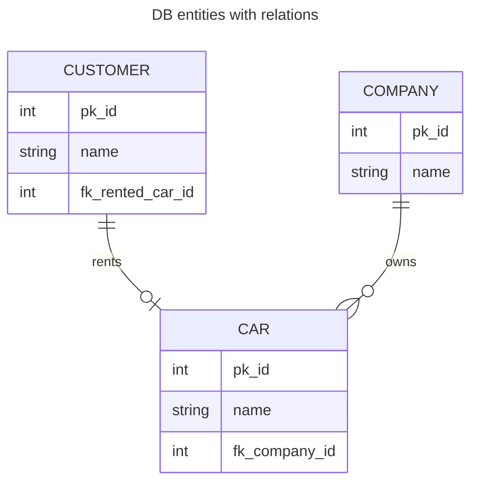
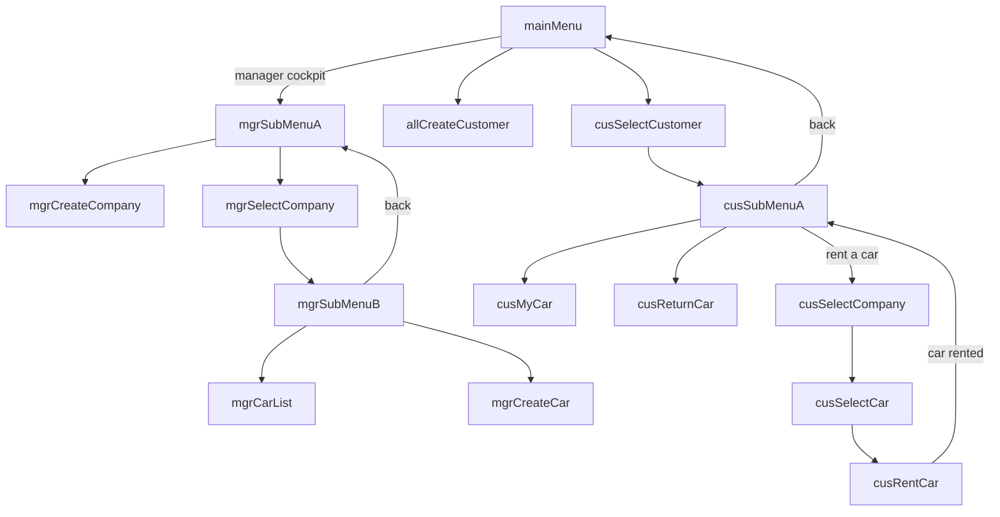

# Hyperskill project - Car Sharing service

## Summary of the project

Brief description: Car-sharing is becoming a more and more popular green alternative to owning a car. 
Here the goal is to create a program that manages a car-sharing service allowing companies to rent out their cars to customers.
Project is simple, so we'll not care about price. 
But at the same time we'll deal with car availability, setting up companies and new customers and also adding cars to companies fleet.

This is console based with multilevel menu run from Main. Data storage via H2 RDB. 

MVC approach controller -> service -> persistence.

Interesting part was to make program flexible with user of DAO interface with limited available methods and generic DB client class that can be used by every DAO class. Additionally, an interface to map db query results to objects has been applied.

## Elements

### Data objects
* Customer
* Car
* Company

All above have corresponding DAO classes that deals with DB interactions

### 

### Multilevel menu flowchart
* All levels have option to go back by single step (not marked on graph for clarity)
  * Exceptions that jump back by more than one step are marked with back arrow
* Method prefixes: 
  * cus -> customer
  * mgr -> manager
  * all -> everyone
* Menu framework reused and modified from https://github.com/afitzgibbon/Java---Console-Menu-Framework.git (btw really liked it)
